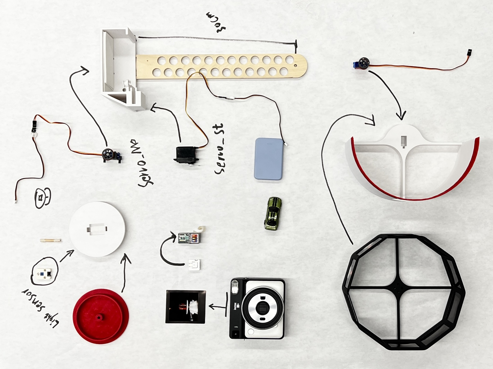
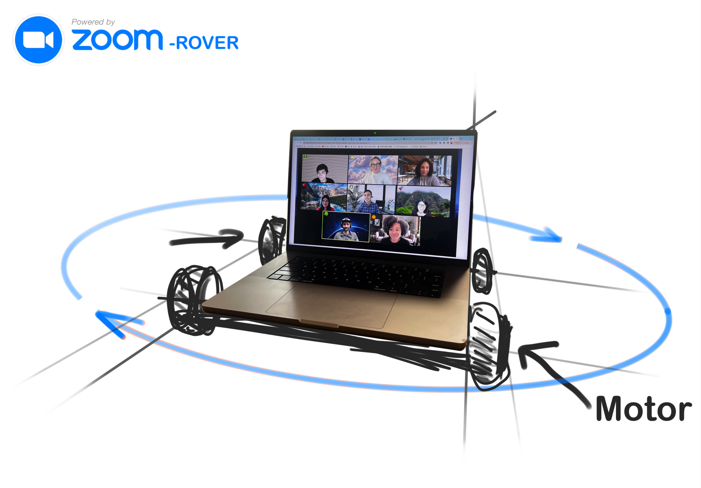
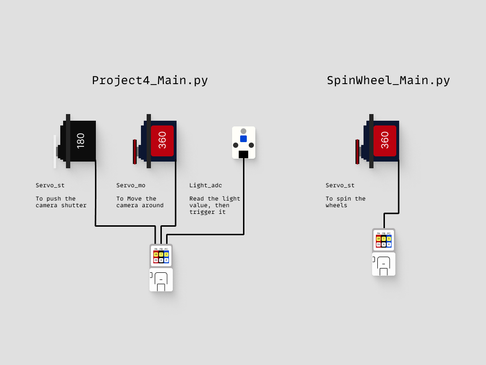
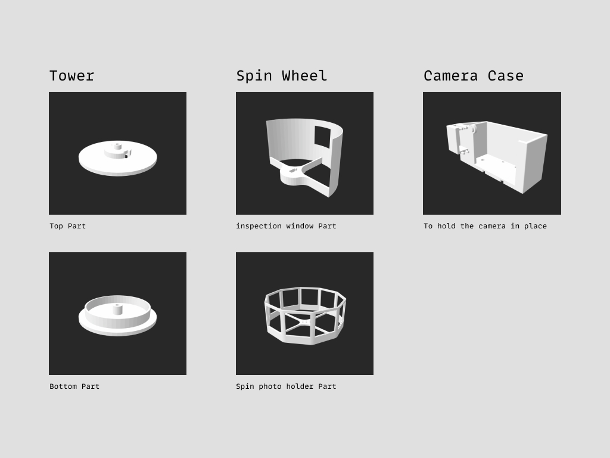

# 360 Photo booth
  

## 1. Ideations

 

## 2. Connections

## 3. 3D Modeling

    

## 4. How does it work

- Place an object on the tower
* The light sensor on the tower will receive a lower light value
+ Lower light value will till the board to move the servos
- This loop will repeat 10 times
  > - Servo_Move will move 36 degrees
  > - Servo_Move stops
  > - Wait 1 second
  > - Servo_Shutter will push the Shutter button to take a photo
  > - Servo_Shutter back to rest position
  > - Wait 7 seconds

 
  

