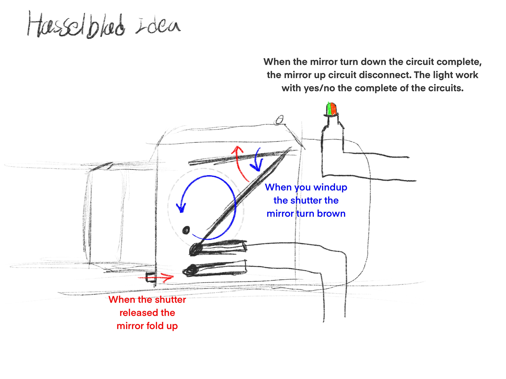
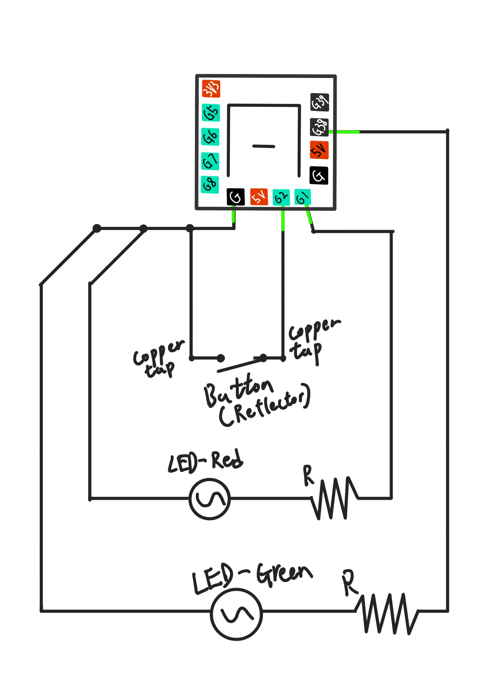

# Hasselblad Winding Reminder

## 1.How to take a photo with Hasselblad 500cm

- Before taking any photos, put in a roll of film, Lock the... Take off the Len cap, and ***Pull out the dark slide*** (Jason is doing some cool stuff with that)
* Release the shutter. 
+ (what happened inside the camera
  > - Reflect mirror ***FOLD UP***
  > - shutter curtain OPENS
  > - Iris in lens OPENS
  > - Iris in lens CLOSES
  > - shutter curtain CLOSES
  > - Reflect mirror FOLD DOWN? ***NOOO!*** It doesn't
  
- Wind up the shutter again (while winding
  > - Reflect mirror ***FOLD DOWN***
  > - Iris OPENS
* Release again

+ Hasselblad Advertisements 1970
+ 

## 2.How does my project works

- Every time you want to take a photo, you need to wind the mirror down.
* And that mirror becomes a button, which can create an open/close circuit
+ Hopefully, I can make my chip read if it is an open/closed circuit
- By reading the circuit, and using if/else logic to turn on/off two lights

+ Winding Reminder Ideation
+ 
- Winding Reminder Circuit Diagram 
- 

